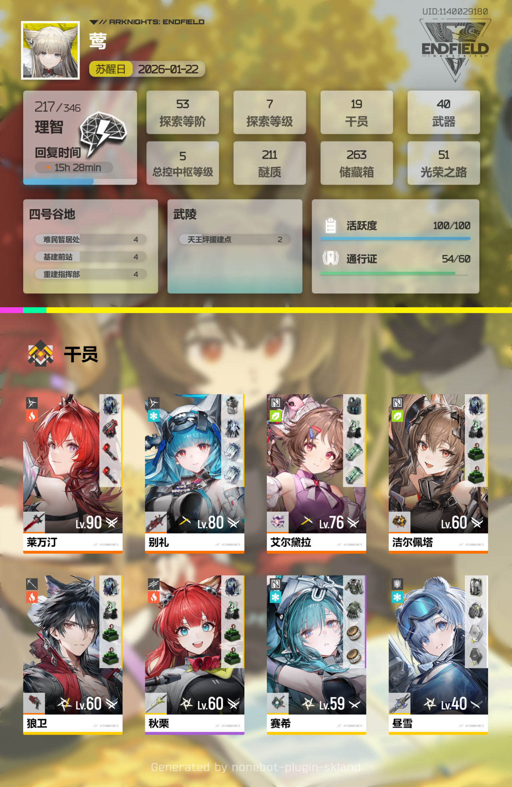
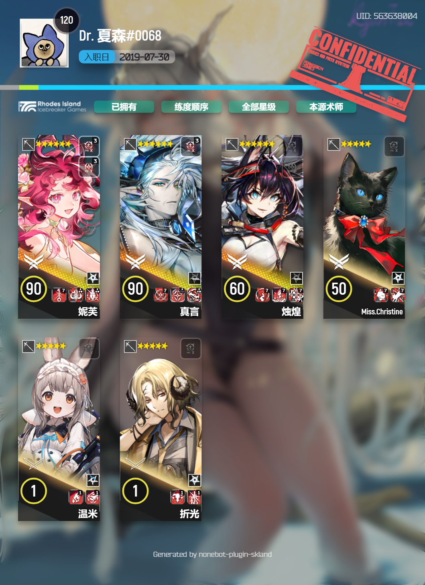
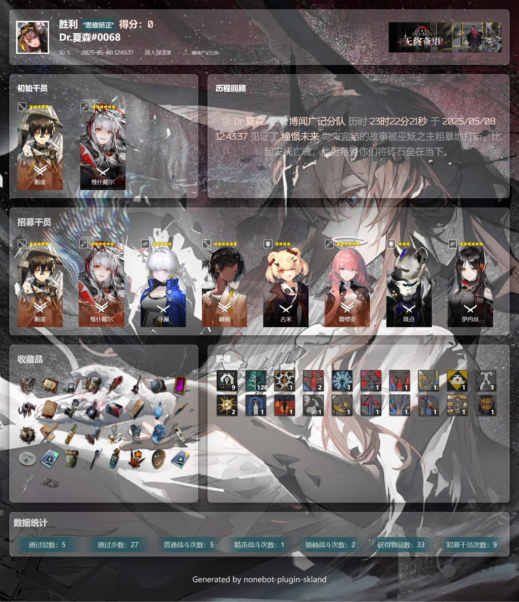
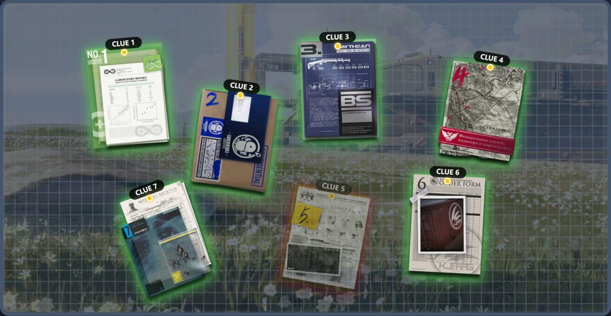
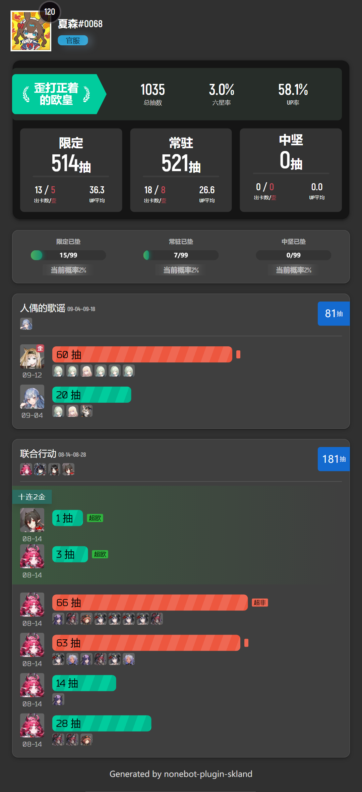
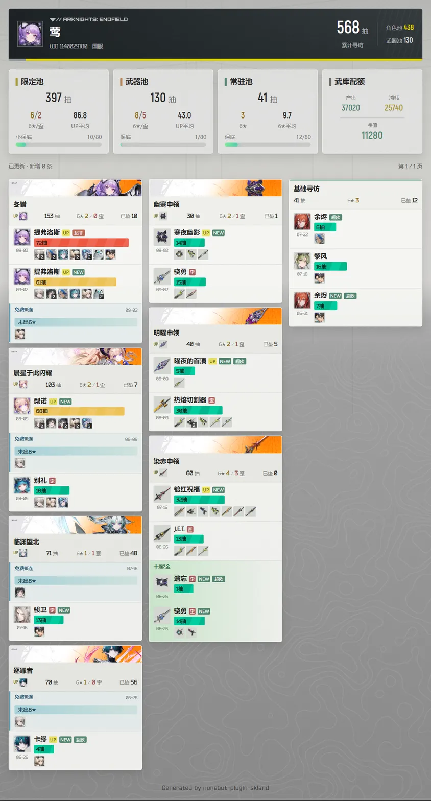

<!-- markdownlint-disable MD024 MD028 MD033 MD036 MD041 MD046 -->
<div align="center">
  <a href="https://v2.nonebot.dev/store"></a>
  <br>
</div>

<div align="center">

# nonebot-plugin-skland

_✨ 通过森空岛查询游戏数据 ✨_

<a href="./LICENSE">
    
</a>
<a href="https://pypi.python.org/pypi/nonebot-plugin-skland">
    
</a>
<a href="https://pypi.python.org/pypi/nonebot-plugin-skland">
    
</a>

<br>
<a href="https://results.pre-commit.ci/latest/github/FrostN0v0/nonebot-plugin-skland/master">
    
</a>
<a href="https://registry.nonebot.dev/plugin/nonebot-plugin-skland:nonebot_plugin_skland">
  
</a>
<a href="https://github.com/astral-sh/uv">
    
</a>
<a href="https://github.com/astral-sh/ruff">

</a>
<a href="https://www.codefactor.io/repository/github/FrostN0v0/nonebot-plugin-skland">
</a>

<br />
<a href="#-效果图">
  <strong>📸 演示与预览</strong>
</a>
&nbsp;&nbsp;|&nbsp;&nbsp;
<a href="#-安装">
  <strong>📦️ 下载插件</strong>
</a>
&nbsp;&nbsp;|&nbsp;&nbsp;
<a href="https://qm.qq.com/q/bAXUZu1BdK" target="__blank">
  <strong>💬 加入交流群</strong>
</a>

</div>

## 📖 介绍

通过森空岛查询游戏数据

> [!NOTE]
> 本插件存在大量未经验证的数据结构~~以及 💩 山~~
>
> 如在使用过程中遇到问题，欢迎提 [issue](https://github.com/FrostN0v0/nonebot-plugin-skland/issues/new/choose) 帮助改进项目


<details>
  <summary><kbd>Star History</kbd></summary>
  <picture>
    
  </picture>
</details>

## 💿 安装

<details open>
<summary>使用 nb-cli 安装</summary>
在 nonebot2 项目的根目录下打开命令行, 输入以下指令即可安装

    nb plugin install nonebot-plugin-skland

</details>

<details>
<summary>使用包管理器安装</summary>
在 nonebot2 项目的插件目录下, 打开命令行, 根据你使用的包管理器, 输入相应的安装命令

<details>
<summary>pip</summary>

    pip install nonebot-plugin-skland

</details>
<details>
<summary>pdm</summary>

    pdm add nonebot-plugin-skland

</details>
<details>
<summary>uv</summary>

    uv add nonebot-plugin-skland

</details>
<details>
<summary>poetry</summary>

    poetry add nonebot-plugin-skland

</details>
<details>
<summary>conda</summary>

    conda install nonebot-plugin-skland

</details>

打开 nonebot2 项目根目录下的 `pyproject.toml` 文件, 在 `[tool.nonebot]` 部分追加写入

    plugins = ["nonebot_plugin_skland"]

</details>

## ⚙️ 配置

### 配置表

在 nonebot2 项目的`.env`文件中修改配置项

|                配置项                | 必填  |   默认值    |                   说明                    |
| :----------------------------------: | :---: | :---------: | :---------------------------------------: |
|      `skland__github_proxy_url`      |  否   | `"https://gh-proxy.com/"` | GitHub 代理前缀；显式设为空字符串则直连 |
|        `skland__github_token`        |  否   |    `""`     |               GitHub Token                |
|      `skland__check_res_update`      |  否   |   `False`   |         是否在启动时检查图片资源更新          |
|    `skland__auto_update_resources`   |  否   |   `True`    | 每天 09:00 自动更新游戏数据与卡池数据，不下载图片 |
| `skland__ark_portrait_cache_enabled` |  否   |   `False`   |      是否按需缓存方舟干员半身图       |
|     `skland__background_source`      |  否   | `"default"` |               背景图片来源                |
| `skland__endfield_background_simple` |  否   |   `False`   |          终末地背景图片简化模式           |
|  `skland__rogue_background_source`   |  否   |  `"rogue"`  |           肉鸽战绩背景图片来源            |
|        `skland__argot_expire`        |  否   |    `300`    |          暗语消息过期时间（秒）           |
|   `skland__ark_card_cache_ttl`    |  否   |    `120`    |       玩家角色卡短期缓存时间（秒）        |
| `skland__ark_card_cache_max_entries` |  否   |    `64`     |       玩家角色卡缓存角色数量上限          |
|      `skland__gacha_render_max`      |  否   |    `30`     | 明日方舟抽卡记录单图渲染上限（单位:卡池） |
|    `skland__ef_gacha_render_max`     |  否   |     `5`     | 终末地每页各类别卡池上限，同时按内容高度分页 |
|     `skland__roster_render_max`     |  否   |    `16`     |      方舟干员单图渲染数量上限       |
|       `skland__render_timeout`       |  否   |  `180000`   |          模板截图超时时间（毫秒）          |
|   `skland__roster_render_format`   |  否   |  `"jpeg"`  |       方舟干员图片格式：`png` / `jpeg`       |
|    `skland__roster_jpeg_quality`    |  否   |    `90`     |        方舟干员 JPEG 质量（1-100）         |

> [!TIP]
> 不配置 GitHub 代理时默认使用 [gh-proxy.com](https://gh-proxy.com/)，已有自定义配置不会被覆盖，显式空字符串表示直连。公共代理不保证长期可用；数据更新会在代理请求失败后尝试原站，并保留已有可用数据。GitHub Token 仅发送给官方 API，不发送给代理。
>
> 本插件所使用的`干员半身像`、`技能图标`等资源均优先调用本地，不存在时从网络请求。开启 `skland__ark_portrait_cache_enabled` 后，首次渲染仍直接使用远程方舟干员或皮肤半身图；Chromium 加载成功后会将该响应写入本地缓存，后续渲染优先读取本地。该过程不会额外请求图片或重新生成 HTML，接口直接返回的图片链接仍由浏览器访问。方舟干员页面会显式等待字体及全部图片完成加载和解码后截图，不再等待每页进入 `networkidle`；远程背景也会加入该等待。方舟干员默认输出 JPEG 90，可通过配置切回 PNG。全量资源更新仍为可选项。

### background_source

`skland__background_source` 为背景图来源，可选值为字面量 `default` / `Lolicon` / `random` 或者结构 `CustomSource` 。 `Lolicon` 为网络请求获取随机带`arknights`tag 的背景图，`random`为从[默认背景目录](/nonebot_plugin_skland/resources/images/background/)中随机, `CustomSource` 用于自定义背景图。 默认为 `default`。

`rogue_background_source` 为肉鸽战绩背景图来源，可选值为字面量 `default` / `Lolicon` / `rogue` 或者结构 `CustomSource` 。 `rogue`为根据肉鸽主题提供的一套默认背景图。

方舟干员页面复用 `skland__background_source`；当值为 `default` 时不传背景图片，由模板使用纯色 `#3F3F3F`，其余选项直接沿用上述解析逻辑。

以下是 `CustomSource` 用法示例

在配置文件中将对应的背景来源字段设置为 `CustomSource` 结构的字典；以下以 `skland__background_source` 为例。

<details>
  <summary>CustomSource配置示例</summary>

- 网络链接

  - `uri` 可为网络图片 API，只要返回的是图片即可
  - `uri` 也可以为 base64 编码的图片，如 `data:image/png;base64,xxxxxx` ~~（一般也没人这么干）~~

```env
skland__background_source = '{"uri": "https://example.com/image.jpg"}'
```

- 本地图片

> - `uri` 也可以为本地图片路径，如 `imgs/image.jpg`、`/path/to/image.jpg`
> - 如果本地图片路径是相对路径，会使用 [`nonebot-plugin-localstore`](https://github.com/nonebot/plugin-localstore) 指定的 data 目录作为根目录
> - 如果本地图片路径是目录，会随机选择目录下的一张图片作为背景图

```env
skland__background_source = '{"uri": "/imgs/image.jpg"}'
```

</details>

## 🎉 使用

> [!NOTE]
> 记得使用[命令前缀](https://nonebot.dev/docs/appendices/config#command-start-%E5%92%8C-command-separator)哦

### 🪧 指令总览

<details open>
<summary><b>🔐 账号管理</b></summary>

| 指令                                          | 权限     | 说明                                           |
| --------------------------------------------- | -------- | ---------------------------------------------- |
| `skland bind <token\|cred>`                  | 所有     | 新增森空岛账号，确认角色列表后保存             |
| `skland bind -u <token\|cred>`               | 所有     | 更新由凭证识别的既有森空岛账号                 |
| `skland qrcode`                               | 所有     | 扫码后确认角色列表，新增或更新对应账号         |
| `skland unbind`                               | 所有     | 交互选择一个账号或全部账号并二次确认解绑       |
| `skland char`                                 | 所有     | 查看全部森空岛账号、游戏角色及当前插件默认角色 |
| `skland char set <ark\|ef> <序号>`           | 所有     | 按游戏独立序号切换插件默认角色                 |
| `skland char update`                          | 所有     | 逐账号同步自己的森空岛角色                     |
| `skland char update --all`                    | 超级用户 | 逐账号同步所有用户的森空岛角色                 |

同一 NoneBot 用户可绑定多个森空岛账号。明日方舟与终末地分别维护一个插件默认角色；角色查询、签到、肉鸽和抽卡始终使用所选角色所属账号的凭证。角色序号不会持久化，同步后请以最新 `skland char` 卡片为准。

账号角色卡采用统一的档案式布局，展示昵称、玩家 UID、区服名称、选择序号和默认/绑定状态。方舟显示角色 UID，终末地显示游戏内玩家 UID；森空岛账号标识、终末地绑定 UID、服务器内部编号和等级不在卡片中展示。

**快捷指令：** `森空岛绑定` `扫码绑定` `森空岛解绑` `森空岛角色` `切换方舟角色 <序号>` `切换终末地角色 <序号>` `角色更新` `全体角色更新`

</details>

<details open>
<summary><b>🎮 游戏信息</b></summary>

| 指令            | 权限 | 说明                   |
| --------------- | ---- | ---------------------- |
| `skland`        | 所有 | 查询默认角色信息卡片   |
| `skland --role <序号>` | 所有 | 临时查询自己的指定方舟角色，不切换默认 |
| `skland @某人`  | 所有 | 查询指定用户的角色信息 |
| `skland <QQ号>` | 所有 | 查询指定QQ号的角色信息 |

默认角色由插件按游戏独立管理，不再跟随森空岛账号的默认设置。本人尚未选择默认角色时，相关命令会返回最新账号角色卡片并提示使用 `skland char set`。

`--role` 使用最新 `skland char` 卡片中对应游戏的角色序号，不是账号序号或玩家 UID；无需预先设置默认角色，只对本次命令生效。它只允许选择自己的绑定角色，序号无效时会提示重新查看卡片，不会回退到默认角色。裸数字仍表示 QQ 目标，不能用 `skland 2` 代替 `skland --role 2`。

所有按角色执行的入口均支持 `-r` / `--role`：角色卡片、两游戏抽卡查询、终末地战争回响、抽卡导入、方舟干员、肉鸽战绩与详情、两游戏个人签到与签到状态。例：`sk gacha -r 2`、`sk efgacha -r 2`、`sk efwar -r 2`、`sk rogue -r 2`。绑定、解绑、账号管理、资源同步及超管全体签到不按单个游戏角色执行。

干员查询的 `-r` 也统一表示角色；星级短选项改为 `-ra`，保留 `--rarity` 和 `6星` 等自然筛选词。例如 `sk box -r 2 -ra 6` 查询第 2 个角色的六星干员。

</details>

<details open>
<summary><b>✍️ 每日签到</b></summary>

#### 明日方舟签到

| 指令                           | 权限     | 说明                      |
| ------------------------------ | -------- | ------------------------- |
| `skland arksign sign --all`    | 所有     | 签到所有绑定角色          |
| `skland arksign sign --role <序号>` | 所有 | 按方舟角色序号签到，不切换默认 |
| `skland arksign status [-r <序号>]` | 所有 | 查询本人全部或指定角色的签到状态 |
| `skland arksign all`           | 超级用户 | 签到所有绑定到 bot 的角色 |
| `skland arksign status --all`  | 超级用户 | 查询所有角色的签到状态    |

**快捷指令：** `明日方舟签到` `签到详情` `全体签到` `全体签到详情`

#### 终末地签到

| 指令                          | 权限     | 说明                      |
| ----------------------------- | -------- | ------------------------- |
| `skland efsign sign --all`    | 所有     | 签到所有绑定角色          |
| `skland efsign sign --role <序号>` | 所有 | 按终末地角色序号签到，不切换默认 |
| `skland efsign status [-r <序号>]` | 所有 | 查询本人全部或指定角色的签到状态 |
| `skland efsign all`           | 超级用户 | 签到所有绑定到 bot 的角色 |
| `skland efsign status --all`  | 超级用户 | 查询所有角色的签到状态    |

**快捷指令：** `终末地签到` `终末地签到详情` `终末地全体签到` `终末地全体签到详情`

两游戏的 `sign` 不带选项时签到默认角色。`-r` / `--role` 与 `--all` 不能同时使用；原 `-u` / `--uid` / `uid` 指定 UID 签到入口已移除。绑定、角色同步和抽卡更新等命令中表示“更新”的 `-u` 不受影响。

`明日方舟签到` / `终末地签到` 不带参数时仍签到本人全部角色；追加 `-r 2` 时只签到第 2 个角色。`签到详情 -r 2` / `终末地签到详情 -r 2` 只显示该角色的缓存结果；签到和状态中的 `-r` 都不能与 `--all` 同用。

#### 终末地角色卡片

| 指令                  | 权限 | 说明                         |
| --------------------- | ---- | ---------------------------- |
| `skland efcard`       | 所有 | 查询终末地角色信息卡片       |
| `skland efcard --role <序号>` | 所有 | 临时查询自己的指定终末地角色，不切换默认 |
| `skland efcard @某人` | 所有 | 查询指定用户的终末地角色信息 |
| `skland efcard -a`    | 所有 | 展示所有角色                 |
| `skland efcard -s`    | 所有 | 使用简化背景                 |

**快捷指令：** `ef`


#### 终末地战争回响

| 指令 | 权限 | 说明 |
| ---- | ---- | ---- |
| `skland efwar` | 所有 | 查询当前赛季与当前轮换的战争回响战绩 |
| `skland efwar -r <序号>` | 所有 | 临时查询自己的指定终末地角色 |
| `skland efwar -s <赛季> -w <轮换>` | 所有 | 查询指定赛季与轮换；`-s -1` 表示上一赛季 |

**快捷指令：** `终末地战争回响`

</details>

> [!TIP]
> 插件会在每天 00:15 自动为所有明日方舟绑定角色签到，00:20 自动为所有终末地绑定角色签到，一般无需手动签到

<details open>
<summary><b>📦 方舟干员</b></summary>

| 用法 | 说明 |
| --- | --- |
| `方舟干员` | 查询全部星级的已拥有干员，按实装顺序排列 |
| `方舟干员 未拥有 6星` | 查询尚未拥有的六星干员 |
| `方舟干员 全部 5-6星` | 查询五星和六星完整图鉴 |
| `方舟干员 近卫 满潜 练度` | 查询满潜近卫并按练度排列 |
| `方舟干员 @某人 远程 女 最近` | 查询指定用户最近获得的远程女性干员 |
| `方舟干员 -r 2 -ra 6` | 查询自己的第 2 个方舟角色持有的六星干员 |

**可直接使用的自然筛选词：**

| 维度 | 可直接使用的写法 |
| --- | --- |
| 持有状态 | `持有` / `已拥有`；`未拥有` / `未持有` / `缺失` / `缺干员`；`全部` / `图鉴` |
| 星级 | `6星` / `6★` / `5-6星`，范围限定为 1–6 星 |
| 职业 | `先锋` / `近卫` / `重装` / `狙击` / `术师` / `医疗` / `辅助` / `特种`，`术士` 等同于 `术师` |
| 职业分支 | 直接使用分支中文名，例如 `铁卫` / `收割者` / `医师` |
| 部署位置 | `近战` / `近战位`；`远程` / `远程位` |
| 性别 | `男` / `男性`；`女` / `女性` / `女士`；`其他` / `未知` |
| 势力与种族 | 直接使用目录中的中文名，例如 `罗德岛` / `炎` / `萨卡兹`；种族还支持 `不明` / `不公开` |
| 潜能 | `满潜`（潜能 6）/ `潜6` / `潜能6` / `6潜` / `潜3-6` / `潜能3-6` / `3-6潜` |
| 排序 | `实装` / `实装顺序`；`获取` / `最近` / `最近获得` / `获取顺序`；`练度` / `练度排序` |
| 名称 | 直接输入干员名称或代号片段，或使用 `名字:阿米娅` / `名称:阿米娅` |

同一维度内为“或”，不同维度之间为“且”；筛选词必须使用空格分隔。查询他人时将 @ 或 QQ 号放在筛选词之前。裸数字会作为 QQ 目标解析，因此星级必须写成 `6星`，潜能必须写成 `潜6` 或 `满潜`。

高级调用支持 `skland box [target] [filters ...] [options]`：`-r` / `--role` 选择自己的角色，`-ra` / `--rarity` 筛选星级；`--ownership`、`--position`、`--potential`、`--sort` 等参数保持原义。自然筛选词和高级参数可以混用；集合条件合并为“或”，互相冲突的持有状态、排序或名称会返回明确提示。

页面使用玩家信息头部和 4 列干员卡，展示精英阶段、等级、潜能、技能与模组。获取排序使用森空岛 `gainTime`；练度排序依次比较精英阶段、等级、专精、已解锁模组、技能等级和信赖。未拥有干员没有潜能、获取时间或练度。结果超过 `skland__roster_render_max` 时自动分图，QQClient 使用合并转发，其余平台逐图发送。

</details>

<details open>
<summary><b>🎲 肉鸽战绩</b></summary>

| 指令                          | 权限 | 说明                       |
| ----------------------------- | ---- | -------------------------- |
| `skland rogue [-r <序号>]` | 所有 | 查询默认或指定角色的最新肉鸽战绩 |
| `skland rogue @某人`          | 所有 | 查询指定用户的肉鸽战绩     |
| `skland rogue --topic <主题>` | 所有 | 查询指定主题的肉鸽战绩     |
| `skland rginfo <战绩id> [-r <序号>]` | 所有 | 查询最近战绩的详细信息 |
| `skland rginfo <战绩id> -f [-r <序号>]` | 所有 | 查询收藏战绩的详细信息 |

**主题选项：** `傀影` `水月` `萨米` `萨卡兹` `界园` `黑流树海`

**快捷指令：** `战绩详情` `收藏战绩详情` `傀影肉鸽` `水月肉鸽` `萨米肉鸽` `萨卡兹肉鸽` `界园肉鸽` `树海肉鸽`

</details>

> [!TIP]
> 战绩详情不带 `-r` 时使用回复图片中的数据；带 `-r` 时重新查询自己的指定角色，有回复时沿用该图的肉鸽主题，无回复时使用该角色当前主题。线索、背景等回复交互继续使用原图片携带的数据，不会切回默认角色。

<details open>
<summary><b>🎰 抽卡记录</b></summary>

| 指令                               | 权限 | 说明                   |
| ---------------------------------- | ---- | ---------------------- |
| `skland gacha [-r <序号>]` | 所有 | 查询默认或指定角色的完整抽卡记录 |
| `skland gacha -b <起始id>`         | 所有 | 从指定位置开始查询     |
| `skland gacha -l <结束id>`         | 所有 | 查询到指定位置结束     |
| `skland gacha -b <起始> -l <结束>` | 所有 | 查询指定范围的抽卡记录 |
| `skland import <url> [-r <序号>]` | 所有 | 导入小黑盒记录到默认或指定角色 |

**快捷指令：** `方舟抽卡记录` `导入抽卡记录`

</details>

> [!TIP]
> 抽卡记录使用提示：
>
> - 支持指定范围查询，如 `skland gacha -b -3` 查询倒数 3 个卡池
> - 或者 `skland gacha -b 3 -l 25` 查询第 3 到 25 个卡池
> - 导入记录时，在小黑盒抽卡分析页底部点击`数据管理`导出并复制链接
> - `-r` 可与 `-b` / `-l` 同用；导入仍校验文件中的玩家 UID 与所选角色一致，不会改写默认角色
> - 单页卡池数超过配置的 `skland__gacha_render_max` 会输出多张图片

<details open>
<summary><b>🎰 终末地抽卡记录</b></summary>

| 指令                                 | 权限 | 说明                               |
| ------------------------------------ | ---- | ---------------------------------- |
| `skland efgacha [-r <index>]` | 所有 | 获取并保存默认或指定角色的最新抽卡记录，再渲染展示 |
| `skland efgacha -b <begin> -l <end>` | 所有 | 更新记录，并选择各类别卡池的展示范围 |
| `skland efgacha -l 3` | 所有 | 更新记录并只展示各类别前 3 个卡池 |

**快捷指令：** `终末地抽卡记录`。不再需要 `-u`；旧的 `终末地抽卡更新` 入口已移除。

</details>

> [!TIP]
> 终末地抽卡记录使用提示：
>
> - 一条指令完成获取、去重保存和展示；图片渲染或发送失败不会丢失已经保存的新记录。
> - 接口暂时不可用或账号未保存 token 时，有历史记录则明确标注“本地记录 · 本次未更新”；没有历史记录则提示原因。
> - `-b` / `-l` 仍对限定、武器、联合、常驻、新手各类别分别切片，表示起始索引和结束索引，只影响展示。
> - 图片沿用终末地/角色档案的灰阶纹理、深色标题与黄色强调色，保留横幅、头像和出货进度条；卡池的 UP、总抽数、六星/歪卡和垫抽合并展示，不重复分类标题。固定 800px 三列：左列限定池，中列武器池，右列依次为新手、常驻、联合寻访；同类按最近抽卡时间倒序排列，放不下就在下一页原列继续，不跨列补位或跳过卡池。短池完整放置，长池按完整出货事件续段，单页高度上限为 1600px，1.5 倍 PNG 输出最高 1200×2400。累计统计只在首页展示，分页不改变统计和保底。
> - `skland__ef_gacha_render_max` 保留每页各类别的卡池数量上限，实际分页同时受内容高度约束。

<details open>
<summary><b>🔧 资源管理</b></summary>

| 指令                   | 权限     | 说明                   |
| ---------------------- | -------- | ---------------------- |
| `skland sync`          | 超级用户 | 同时更新图片和数据资源 |
| `skland sync --img`    | 超级用户 | 仅更新图片资源         |
| `skland sync --data`   | 超级用户 | 仅更新数据资源         |
| `skland sync --force`  | 超级用户 | 强制更新，忽略版本检查 |
| `skland sync --update` | 超级用户 | 覆盖已存在的文件       |

**快捷指令：** `资源更新` → `skland sync --data`，仅更新数据；支持追加 `--force` 等参数，参数前需有空格。手动 `skland sync` 仍同时更新图片与数据。

</details>

> [!TIP]
> 资源更新选项说明：
>
> - 可以组合使用选项，如 `skland sync --img --force --update`
> - 图片资源包括干员立绘、技能图标等，数据资源包括卡池数据、角色数据等
> - 图片更新默认跳过已存在的文件，使用 `--update` 可覆盖图片；日常数据更新无需加这个选项。
> - 每天 09:00 自动检查方舟游戏数据、PRTS 元数据与卡池详情、终末地卡池表，不涉及图片或玩家接口。沿用 APScheduler 配置的时区，默认 `Asia/Shanghai`；可通过 `skland__auto_update_resources=False` 关闭。
> - 数据更新使用同一上游提交中的固定文件路径，不获取仓库文件树。方舟版本相同且本地完整时不下载六份表；终末地校验远端内容，等价数据不重写本地缓存。
> - 数据校验通过后才替换文件与内存数据；下载或校验失败时保留旧数据并报告失败，PRTS 补充数据失败会保留旧缓存并记录警告。已有数据更新运行时，新的手动请求会提示稍后重试，定时任务则跳过。
> - 交互终端中下载框原地刷新，下载结束、失败或取消后清除，仅保留普通结果日志；输出重定向到文件或非交互日志面板时不显示动态下载框。

<details>
<summary><b>🎨 暗语功能</b></summary>

暗语功能由 [nonebot-plugin-argot](https://github.com/KomoriDev/nonebot-plugin-argot) 提供支持

**使用方法：** 回复插件渲染的图片消息，发送对应的暗语指令

| 暗语指令     | 对象     | 说明           |
| ------------ | -------- | -------------- |
| `background` | 信息卡片 | 查看卡片背景图 |
| `clue`       | 游戏信息 | 查看角色线索板 |

</details>

### 🎯 快捷指令速查

<details>
<summary>查看所有快捷指令</summary>

| 触发词               | 执行指令                      | 说明               |
| -------------------- | ----------------------------- | ------------------ |
| `森空岛绑定`         | `skland bind`                 | 新增账号并确认角色列表 |
| `扫码绑定`           | `skland qrcode`               | 扫码后确认绑定         |
| `森空岛解绑`         | `skland unbind`               | 交互选择账号解绑       |
| `明日方舟签到`       | `skland arksign sign --all`   | 签到所有角色       |
| `签到详情`           | `skland arksign status`       | 个人签到状态       |
| `全体签到`           | `skland arksign all`          | 全部角色签到       |
| `全体签到详情`       | `skland arksign status --all` | 全部签到状态       |
| `ef`                 | `skland efcard`               | 终末地角色卡片     |
| `终末地签到`         | `skland efsign sign --all`    | 终末地签到         |
| `终末地签到详情`     | `skland efsign status`        | 终末地签到状态     |
| `终末地全体签到`     | `skland efsign all`           | 终末地全部签到     |
| `终末地全体签到详情` | `skland efsign status --all`  | 终末地全部签到状态 |
| `森空岛角色`         | `skland char`                | 查看全部绑定账号和角色 |
| `切换方舟角色 <序号>` | `skland char set ark <序号>` | 切换方舟默认角色       |
| `切换终末地角色 <序号>` | `skland char set ef <序号>` | 切换终末地默认角色     |
| `角色更新`           | `skland char update`          | 逐账号同步角色       |
| `全体角色更新`       | `skland char update --all`    | 逐账号同步所有角色   |
| `资源更新`           | `skland sync --data`          | 更新游戏与卡池数据，不下载图片 |
| `树海肉鸽`           |`skland rogue --topic 黑流树海`| 黑流树海主题战绩   |
| `界园肉鸽`           | `skland rogue --topic 界园`   | 界园主题战绩       |
| `萨卡兹肉鸽`         | `skland rogue --topic 萨卡兹` | 萨卡兹主题战绩     |
| `萨米肉鸽`           | `skland rogue --topic 萨米`   | 萨米主题战绩       |
| `水月肉鸽`           | `skland rogue --topic 水月`   | 水月主题战绩       |
| `傀影肉鸽`           | `skland rogue --topic 傀影`   | 傀影主题战绩       |
| `战绩详情`           | `skland rginfo`               | 查询战绩详情       |
| `收藏战绩详情`       | `skland rginfo -f`            | 查询收藏战绩       |
| `方舟抽卡记录`       | `skland gacha -l 3`           | 查询抽卡记录       |
| `导入抽卡记录`       | `skland import`               | 导入抽卡数据       |
| `终末地抽卡记录`     | `skland efgacha`              | 获取、保存并展示最新记录 |
| `终末地战争回响`     | `skland efwar`                | 查询战争回响赛季与轮换战绩 |
| `方舟干员`           | `skland box`                  | 中文筛选词查询干员 |

角色序号按游戏分别计算，以最新 `森空岛角色` 卡片为准；例如 `切换方舟角色 2` 只切换方舟默认角色，不影响终末地。快捷指令和序号之间保留空格，是否需要 `/` 等命令前缀由 Bot 配置决定。

抽卡、战争回响、导入、干员、肉鸽、战绩详情及个人签到/状态的中文快捷指令同样支持追加 `-r <序号>`；例如 `方舟抽卡记录 -r 2`、`终末地抽卡记录 -r 2`、`终末地战争回响 -r 2`、`树海肉鸽 -r 2`。

</details>

### 🪄 自定义快捷指令

基于 [Alconna 快捷指令](https://nonebot.dev/docs/best-practice/alconna/command#command%E7%9A%84%E4%BD%BF%E7%94%A8) 实现

<details>
<summary>点击查看详细说明</summary>

**语法：**

```bash
# 添加快捷指令
/skland --shortcut <自定义指令> <目标指令>

# 删除快捷指令
/skland --shortcut delete <自定义指令>

# 列出所有快捷指令
/skland --shortcut list
```

**示例：**

```bash
# 添加一个签到快捷指令
用户: /skland --shortcut /兔兔签到 "/skland arksign sign --all"
Bot: skland::skland 的快捷指令: "/兔兔签到" 添加成功

# 添加一个查询战绩的快捷指令
用户: /skland --shortcut 查战绩 "skland rogue"
Bot: skland::skland 的快捷指令: "查战绩" 添加成功
```

</details>

> [!NOTE]
>
> - 自定义指令不自动带命令前缀，需要时请手动添加
> - 指令中包含空格时，需要用引号 `""` 包裹

> [!NOTE]
> Token 获取相关文档还没写~~才不是懒得写~~
>
> 可以参考[`token获取`](https://docs.qq.com/doc/p/2f705965caafb3ef342d4a979811ff3960bb3c17)获取
>
> 本插件支持 cred 和 token 两种手动绑定方式，也支持二维码绑定；三种方式都会在保存前展示角色列表并要求命令发起者确认。token、cred 和二维码登录结果均属于敏感凭证，请勿交给不信任的 Bot 所有者。

### 📸 效果图

<details id="效果图">
  <summary>🔮 游戏信息</summary>

#### 明日方舟


#### 明日方舟：终末地



</details>

<details>
  <summary>🗃️ 方舟干员 Box</summary>



</details>

<details>
  <summary>🫖 肉鸽战绩</summary>


</details>

<details>
  <summary>🏆 战绩详情</summary>



</details>

<details id="游戏信息">
  <summary>🕵️‍♀ 线索板</summary>



</details>

<details>
  <summary>🦭 抽卡记录</summary>

#### 明日方舟



#### 终末地



</details>

## 💖 鸣谢

- [`Alconna`](https://github.com/ArcletProject/Alconna): 简单、灵活、高效的命令参数解析器
- [`NoneBot2`](https://nonebot.dev/): 跨平台 Python 异步机器人框架
- [`yuanyan3060/ArknightsGameResource`](https://github.com/yuanyan3060/ArknightsGameResource): 明日方舟常用素材
- [`KomoriDev/Starify`](https://github.com/KomoriDev/Starify)：超棒的 GitHub Star Trace 工具 🌟📈
- [`KomoriDev/nonebot-plugin-argot`](https://github.com/KomoriDev/nonebot-plugin-argot): 优秀的 NoneBot2 暗语支持

### 贡献者们

<a href="https://github.com/FrostN0v0/nonebot-plugin-skland/graphs/contributors">
  
</a>

## 📢 声明

本插件仅供学习交流使用，数据由 [森空岛](https://skland.com/) 提供，请勿用于商业用途。

使用过程中，任何涉及个人账号隐私信息（如账号 token、cred 等）的数据，请勿提供给不信任的 Bot 所有者（尤其是 token）。

## 📋 TODO

- [x] 完善用户接口返回数据解析
- [x] 使用[`nonebot-plugin-htmlrender`](https://github.com/kexue-z/nonebot-plugin-htmlrender)渲染信息卡片
- [x] 从[`yuanyan3060/ArknightsGameResource`](https://github.com/yuanyan3060/ArknightsGameResource)下载游戏数据、检查数据更新
- [x] 绘制渲染粥游信息卡片
- [x] 支持扫码绑定
- [x] 优化资源获取形式
- [x] 完善肉鸽战绩返回信息解析
- [x] 绘制渲染肉鸽战绩卡片
- [x] 粥游签到自动化
- [x] 实现抽卡记录获取及渲染
- [x] 支持抽卡记录导入(从小黑盒)
- [x] 抽卡记录分页
- [x] 支持终末地角色信息查询及签到
- [x] 支持终末地抽卡记录查询及分页
- [x] 实现 box 查询
- [x] 实现图鉴查询
- [ ] 完善多服账号管理
- [ ] ~~扬了不必要的 💩~~
- [ ] 待补充，欢迎 pr
